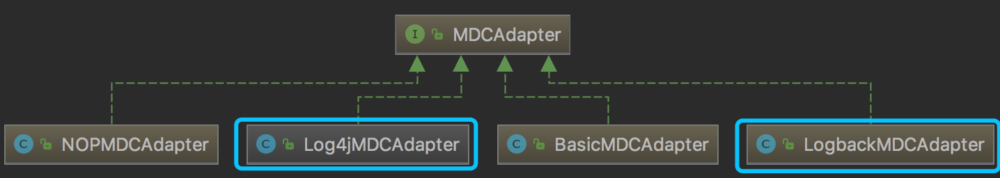
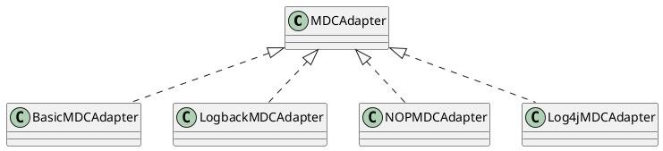

## MDC

MDC(Mapped Diagnostic Context) 是日志框架 提供的一种线程安全的存放诊断日志的容器。
```java
/**
 * @see org.slf4j.MDC
 */
public class MDC {
    // 将上下文的值作为 MDC 的 key 放到线程上下的 map 中
    public static void put(String key, String val);

    // 通过 key 获取上下文标识
    public static String get(String key);

    // 通过 key 移除上下文标识
    public static void remove(String key);

    // 清除 MDC 中所有的 entry
    public static void clear();
}
```
通过 org.slf4j.MDC 的源码，可以很清楚的知道 MDC 主要是通过 MDCAdapter 来完成 put get remove 等操作。






## MDC上下文传递

MDC中的内容是线程绑定的，在多线程场景下，需要将MDC中的内容传递给子线程，否则子线程中无法获取到MDC中的内容。
MDC上下文传递就是通过工具类或者自定义线程池，在多线程之间传递MDC内容，以便在整个请求处理过程中记录日志，方便问题定位。

## 使用场景

1. 接收到请求时，在拦截器将请求的唯一标识放入MDC中，方便链路追踪
```java

@Component
public class MdcInterceptor implements HandlerInterceptor {

    public static final String TRACE_ID = "traceId";

    @Override
    public boolean preHandle(HttpServletRequest request, HttpServletResponse response, Object handler)  {
        if (StringUtils.isBlank(request.getHeader(TRACE_ID))) {
            MDC.put(TRACE_ID, TraceIdUtils.generateTraceId());
        } else {
            MDC.put(TRACE_ID, request.getHeader(TRACE_ID));
        }
        return true;
    }

    @Override
    public void afterCompletion(HttpServletRequest request, HttpServletResponse response, Object handler, Exception ex) {
        MDC.remove(TRACE_ID);
    }

}

```
2. 异步任务执行时，将MDC中的内容传递给子线程，方便日志记录
```java
    // 异步任务执行时，将MDC中的内容传递给子线程
    Runnable wrapRunnable = MdcUtils.wrap(() -> {
       // do something
    }, MDC.getCopyOfContextMap());
```
3. 自定义线程池执行任务时，将MDC中的内容传递给子线程，方便日志记录

```java
    // 自定义线程池
    @Bean("mdcThreadPoolExecutor")
    public Executor mdcThreadPoolExecutor() {
        int corePoolSize = 5;
        int maxPollSize = 10;
        int keepAliveSeconds = 60;
        int queueCapacity = 100;
        ThreadFactory threadFactory = new ThreadFactoryBuilder()
        .setNameFormat(THREAD_NAME_PREFIX.concat("task")).build();
        return new MdcThreadPoolTaskExecutor(corePoolSize, maxPollSize, keepAliveSeconds, TimeUnit.SECONDS, new LinkedBlockingDeque<>(queueCapacity), threadFactory, new ThreadPoolExecutor.AbortPolicy());
    }
    
    // 使用自定义线程池
    @Resource(name = "mdcThreadPoolExecutor")
    private Executor executor;
    
    // 执行任务
    public void doprocess() {
        executor.execute(() -> {
            // do something
        });
    }

```

## 日志打印

```java
    MDC.put("traceId", UUID.randomUUID().toString());  // X%{traceId} 为日志文件中打印的内容
``` 

```xml 
<?xml version="1.0" encoding="UTF-8"?>
<configuration>
    <appender name="console" class="ch.qos.logback.core.ConsoleAppender">
        <encoder>
            <pattern>%d{HH:mm:ss.SSS} [%thread] [%X{traceId}] %-5level %logger{36} - %msg%n</pattern>
        </encoder>
    </appender>
    <root level="INFO">
        <appender-ref ref="console" />
    </root>
</configuration>
```

## 注意事项

MDC使用记得清除，否则会造成内存泄漏